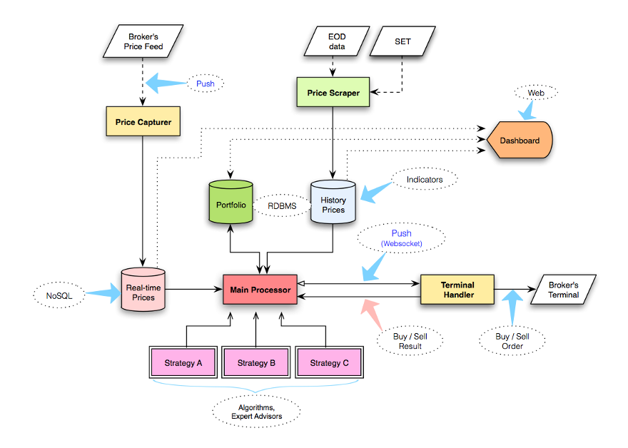

# Automated Trading Platform for SET

FOR EDUCATIONAL PURPOSES ONLY.

This project is just a proof-of-concept about automated trading platform (for robot, EA - Expert Advisor) on The Stock Exchange of Thailand. On 2013, there is no broker that provides automated trading method to (poor) individual investors, only institutional investors can take the advantage. The platform allows individual investors/traders automatically send orders to the market when the securities prices match up with their pre-conditions.

The project consists of 5 modules,

* [bls_monitor](https://github.com/tonkla/trading-platform/tree/master/bls_monitor) scrapes real-time prices of the securities from the broker platform.
* [set_scraper](https://github.com/tonkla/trading-platform/tree/master/set_scraper) scrapes necessary data of the securities from SET website.
* [klass_stock](https://github.com/tonkla/trading-platform/tree/master/klass_stock) a web dashboard that acts as the main command center, including a portfolio summary.
* [klass_trade](https://github.com/tonkla/trading-platform/tree/master/klass_stock/lib) acts as the central processing unit, watches real-time prices, finds the trading signals.
* [klass_trade_client](https://github.com/tonkla/trading-platform/tree/master/klass_trade_client) handles the broker trading terminal, listens the signal from `klass_trade`, then triggers the UIs.

### Conclusion

This project is just the experiment, it could work by following the hypothesis but still be far away from the practical use. Firstly, the tools (Ruby, and certainly, my coding skill) are not suitable for this job, it is quite slow for (a lot of) data processing, it should be faster. Secondly, it is a kind of dirty hack, which quite hard to use, nowadays many brokers provide official tools for doing automated trading for individual investors. Thirdly, I have not enough knowledge about trading, so I cannot craft the profitable robot. Lastly, after that, I found the [MetaTrader4](https://www.metatrader4.com/en) (with [MQL4](https://docs.mql4.com/)), this is what I really want about automated trading platform, it is the one of great softwares that I have used.
